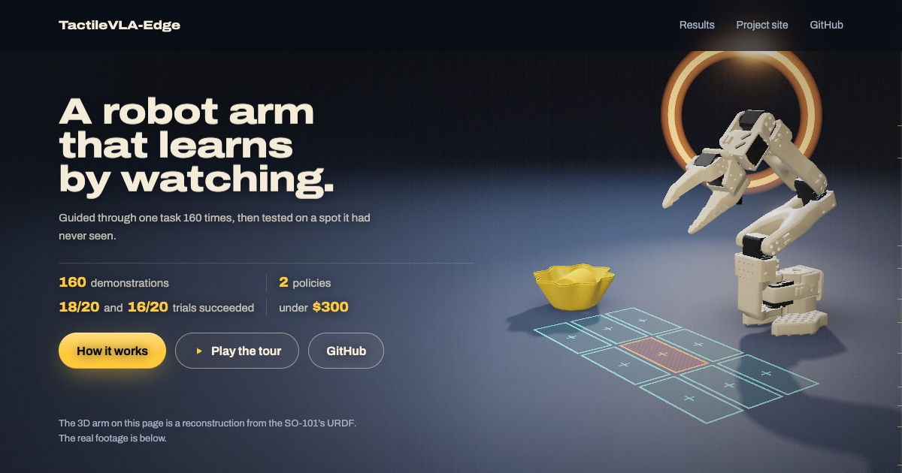
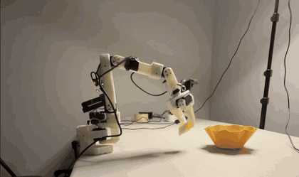
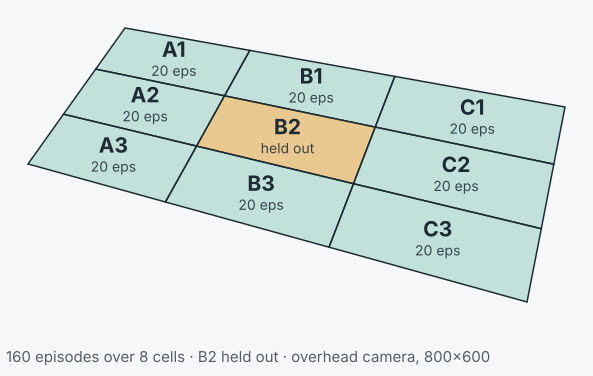
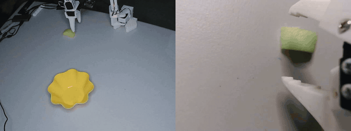

<div align="center">

# TactileVLA-Edge

**A vision-language-action stack for contact-rich robot manipulation on sub-$300 hardware,
working toward on-device tactile inference.**

[](https://vishal-naveen.github.io/tactilevla-demo/)
&nbsp;
[](https://vishal-naveen.github.io/TactileVLA-Edge/)
&nbsp;
[](docs/results.md)

<a href="https://vishal-naveen.github.io/tactilevla-demo/"></a>

**[Open the interactive 3D demo](https://vishal-naveen.github.io/tactilevla-demo/)**: a guided tour of the whole project, the real runs, and a 3D arm you can
send to any cell, including the held-out one. (The 3D arm is a kinematic reconstruction; the videos are the real runs.)



**ACT in cell B2 — a workspace cell that appears in none of the 160 training episodes.**

</div>

---

## Results

| | Autonomous trials | Held-out cell B2 |
|---|---|---|
| **ACT** (52M) | **18 / 20** | success |
| **SmolVLA-450M** | **16 / 20** | success |

20 trials cannot separate 18/20 from 16/20 — the confidence intervals overlap heavily. The result
that matters is that **both architectures generalized into a region of the workspace they were
never shown.** [Details, limits, and what this does not establish](docs/results.md).

> **Status: vision-only baseline complete (Phase 2).** Both policies work. The tactile layer —
> the thing this project is named for — is Phase 3 and **has not been built yet.** Nothing below
> claims otherwise.

## Watch the runs

Four trials filmed end to end, each narrated with the workspace cell called out before the run.
All four succeeded. **Playable on the [project site](https://vishal-naveen.github.io/TactileVLA-Edge/)**
— GitHub won't play them inline.

| Policy | Cell | Clip |
|---|---|---|
| ACT | **B2 — held out** | [`act-b2.mp4`](docs/media/act-b2.mp4) |
| SmolVLA-450M | **B2 — held out** | [`smolvla-b2.mp4`](docs/media/smolvla-b2.mp4) |
| ACT | A2 — trained | [`act-a2.mp4`](docs/media/act-a2.mp4) |
| SmolVLA-450M | C3 — trained | [`smolvla-c3.mp4`](docs/media/smolvla-c3.mp4) |

## What this is

Tactile VLA models exist, but the published work runs on ~$30k research arms. This project aims
to be a **complete, reproducible, open-source tactile-VLA reference stack that runs on hardware
costing under $300** — the arm, the touch sensing, the dataset format, the fusion method, and
the measured results, all in one place.

That is roughly a **100× reduction** in hardware cost against the arms the published tactile-VLA
work runs on. Reading touch off the servos the arm already has is a large part of why: it keeps
the touch channel at zero marginal cost.

To be precise about the claim: this is *not* the first tactile-VLA. Tactile-VLA, TacVLA, and
TacFiLM came first. The intended contribution is the integration at the low-cost end, plus a
tactile fusion recipe inside a 450M-parameter backbone that has not been shown before. That
contribution does not exist yet — what exists today is the baseline it has to beat.

## Dataset

160 teleoperated episodes, 67,693 frames at 30 fps, spread over a 3×3 grid projected onto the
table by homography. Eight cells recorded at **exactly 20 episodes each**; within every cell the
object's yaw sweeps ±90° in 10° steps. The centre cell **B2 was never recorded** — it exists only
to be tested against.

Every episode is driven by hand on the leader arm and reset by hand between takes — four rounds
walking the perimeter `A1→B1→C1→C2→C3→B3→A3→A2`, with the walk order reversed on rounds 2 and 4
so cell identity doesn't alias with within-round drift.
[Time-lapse of the recording session](https://vishal-naveen.github.io/TactileVLA-Edge/#collecting-the-data)
([`recording-timelapse.mp4`](docs/media/recording-timelapse.mp4)).

<div align="center">



</div>

The figure is generated from the recording session's own saved geometry and cell log, so it
cannot drift from what was recorded:

```bash
python3 software/tools/tactilevla-gridfig.py \
  --cells <session>-cells.csv --out docs/media/workspace-grid.svg
```

### What the policy sees

<div align="center">



*Overhead (left) and wrist (right), from episode 0 of the training set.*

</div>

The overhead camera loses the object behind the gripper at exactly the moment contact matters.
The wrist camera is what keeps the grasp legible — and that occlusion is the argument for adding
touch.

## Hardware

| Layer | Component | State |
|---|---|---|
| Arm | SO-101 leader + follower, Feetech STS3215 servos | working |
| Vision | Overhead 800×600 + wrist 640×480, 30 fps | working |
| Policy | ACT and SmolVLA-450M, fine-tuned via LeRobot | working |
| Compute | RTX 3060 for training; Apple Silicon / MPS for inference | working |
| Touch | Servo load (`Present_Load`, STS3215 register 60) | **not integrated** |
| Fusion | FiLM conditioning, token-concat first to prove the plumbing | **not built** |

Touch sensing reads load off the servos the arm already has, so it needs no additional hardware.
This replaced an earlier plan to build an [AnySkin](https://any-skin.github.io) magnetic sensor;
that sensor was never built. Load readout is verified responsive to real force, with caveats
recorded in [`software/README.md`](software/README.md).

## Repository layout

```
software/    Host-side code: operational tooling, and the planned tactile/fusion/eval modules
firmware/    Microcontroller code
hardware/    CAD, STLs, PCB sources, BOMs
docs/        Results, project site, ADRs, engineering log, guides
tests/       Test suite (CI gates every PR)
```

## Where the actual work is

Roughly 80% of the parts are pre-made: SO-101 STLs and assembly docs, pretrained SmolVLA, the
LeRobot pipeline. Assembling that feels productive and fast.

The remaining 20% is the project:

- **Time-synchronized tactile streaming** into the LeRobot dataset format. Cameras run 30 fps and
  servos 30–50 Hz. A misalignment of a couple of frames trains a correlation that isn't real and
  fails in ways that are very hard to debug.
- **FiLM-style tactile fusion** inside SmolVLA's backbone.
- **Honest measurement** of whether touch beats vision on cheap hardware, with enough trials to
  distinguish signal from noise. The baseline above is deliberately the control arm of that
  experiment.

That 20% is slower and harder than the 80%, and it is where both the value and the risk live.

## Roadmap

| Phase | Goal | State |
|---|---|---|
| 0 | Repo, environment, pipeline validated on a public dataset | done |
| 1 | Arm bring-up — leader mirrors follower | done |
| 2 | Vision-only baseline — ACT, then SmolVLA, autonomous pick-and-place | **done** |
| 3 | Tactile integration — sync layer, fusion, contact-rich insertion task | next |
| 4+ | Force/compliance control, on-device inference, dataset release | not started |

Phase 3 carries an explicit go/no-go: if touch does not beat vision-only by a meaningful margin
on at least one task with enough demonstrations, the scope narrows rather than drifting. The
comparison belongs on a contact-rich insertion task, not on this pick-and-place — the literature
puts vision-only imitation learning near 0% on sub-millimetre insertion while tactile-augmented
methods reach ~67%, whereas on foam pick-and-place the difference is negligible.

## Getting started

Hardware bring-up (ports → motors → calibration → teleoperation) is documented in
[`docs/bringup.md`](docs/bringup.md). Recording, training, and evaluation scripts live in
[`software/tools/`](software/tools/README.md).

## License

- Code (`software/`, `firmware/`): **Apache-2.0** — see [LICENSE](LICENSE). Chosen to match
  LeRobot, which this project derives from.
- Hardware (`hardware/`): **CERN-OHL-P v2** — see [LICENSE-hardware](LICENSE-hardware).

## Author

Vishal Naveen
