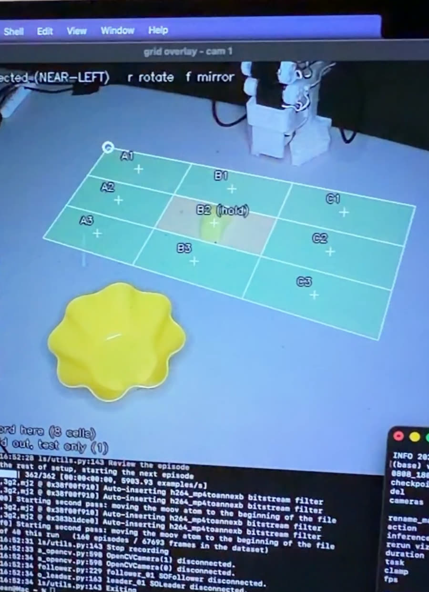
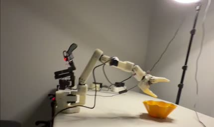
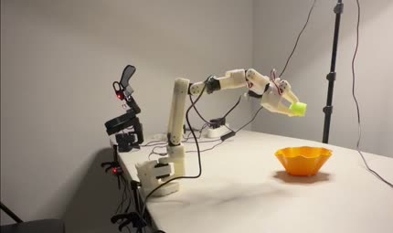

# Results — vision-only baseline

Phase 2 of the [roadmap](../README.md#roadmap): get an autonomous pick-and-place policy working
on the SO-101 before any tactile channel is added. Two architectures, one dataset, one protocol.

**Everything below is vision-only.** No tactile data was recorded or trained on. See
[Scope](#scope) at the bottom.

## Task

> "Grab the pool noodle and put it in the yellow cup"

A segment of foam pool noodle into a plastic cup. The noodle is deformable and rolls, so its
pose is never quite repeatable — which is the point. A rigid cube on a fixed mark can be solved
by memorising one trajectory.

## Hardware

| | |
|---|---|
| Arm | SO-101 leader + follower, Feetech STS3215 servos (12 V follower, 5 V leader) |
| Cameras | Overhead `top` 800×600, `wrist` 640×480, both 30 fps |
| Teleoperation | Leader-follower, recorded through LeRobot 0.5.2 |
| Training | RTX 3060, 12 GB, inside WSL2 |
| Inference | Apple Silicon, MPS |

## Dataset

`noodlegrid_20260808_1807` — recorded 8–11 August 2026.

| | |
|---|---|
| Episodes | 160 |
| Frames | 67,693 |
| Rate | 30 fps |
| Features | `observation.images.top`, `observation.images.wrist`, `observation.state` (6), `action` (6) |
| Format | LeRobot dataset v3.0 |

### Workspace stratification

Demonstrations are spread over a 3×3 grid projected onto the table by homography from four
clicked corners. **Eight cells were recorded at exactly 20 episodes each. B2 — the centre cell —
was never recorded at all**, and exists only to be tested against.


Within each cell, the noodle's yaw is swept across the full ±90° range in 10° steps, so no cell
is a single memorised pose. The grid is a perspective quad rather than a square: outer cells
cover meaningfully more table than inner ones, which matters when reading per-cell results.

The live overlay during recording, with B2 marked `(hold)`:



### What the policy sees

Both camera streams, from episode 0 of the training set — the actual observation space, not a
staged shot:


*Left: overhead. Right: wrist. The wrist camera is what makes the grasp legible; the overhead
camera alone loses the object behind the gripper at contact.*

## Training

Both policies were trained on the same 160 episodes, on the same GPU, from the same LeRobot
commit.

| | ACT | SmolVLA-450M |
|---|---|---|
| Steps | 42,308 | 20,000 |
| Params | ~52 M | ~450 M |
| Backbone | ResNet18 | pretrained VLM, vision encoder frozen |
| Chunk size | 100 | 50 |
| Learning rate | 1e-5, constant | 1e-4, warmup + decay |

## Evaluation

**20 autonomous trials per policy**, run on the physical arm with the leader disconnected, scored
by hand. The control loop was requested at 30 Hz (`tactilevla-eval.sh` default).

| Policy | Success |
|---|---|
| ACT | **18 / 20** |
| SmolVLA-450M | **16 / 20** |

With 20 trials the 95% confidence interval on 18/20 spans roughly 68–99%, and the two policies'
intervals overlap heavily. **This sample cannot establish that ACT beats SmolVLA** — it
establishes that both work. Separating them would need on the order of a hundred trials each.

### Generalization to a held-out cell

The more informative result. B2 appears in **zero** of the 160 training episodes. Both policies
were asked to perform the task with the noodle placed there:

| Policy | B2 | |
|---|---|---|
| ACT | success |  |
| SmolVLA-450M | success |  |


*ACT in B2: approach, grasp, transport, release. No training episode ever placed the object here.*

Both architectures interpolated into an unseen region of the workspace rather than matching the
nearest trained trajectory. On a 160-episode dataset that is the result worth reporting.

## Recorded trials

Four trials were filmed end to end, each narrated on camera with the cell called out before the
run. All four succeeded.

| Clip | Policy | Cell | Outcome |
|---|---|---|---|
| `ACT - A2` | ACT | A2 (trained) | success |
| `ACT - B2` | ACT | B2 (held out) | success |
| `SmolVLA - B2` | SmolVLA-450M | B2 (held out) | success |
| `SmolVLA - C3` | SmolVLA-450M | C3 (trained) | success |

These are demonstrations, not the scored trials — the 20-trial runs above were tallied by hand
without video.

## Scope

What this does **not** establish, stated plainly:

- **Nothing about touch.** Both policies are vision-only. No tactile channel was recorded,
  trained on, or evaluated. The tactile work is [Phase 3](../README.md#roadmap) and has not
  started.
- **Not a comparison between ACT and SmolVLA.** 20 trials cannot separate 90% from 80%.
- **One task, one object, one lighting setup.** Nothing here speaks to a second task.
- **The scored trials have no per-trial record.** Success counts were tallied by hand at the
  time. Future evaluation runs should write a per-trial log with cell and outcome; that
  capability does not exist in `tactilevla-eval.sh` yet.

## Reproducing the figure

```bash
python3 software/tools/tactilevla-gridfig.py \
  --cells <session>-cells.csv \
  --out docs/media/workspace-grid.svg
```

Reads the same `tactilevla-grid.json` the recording session used, so the published figure and the
recorded geometry cannot drift apart.
